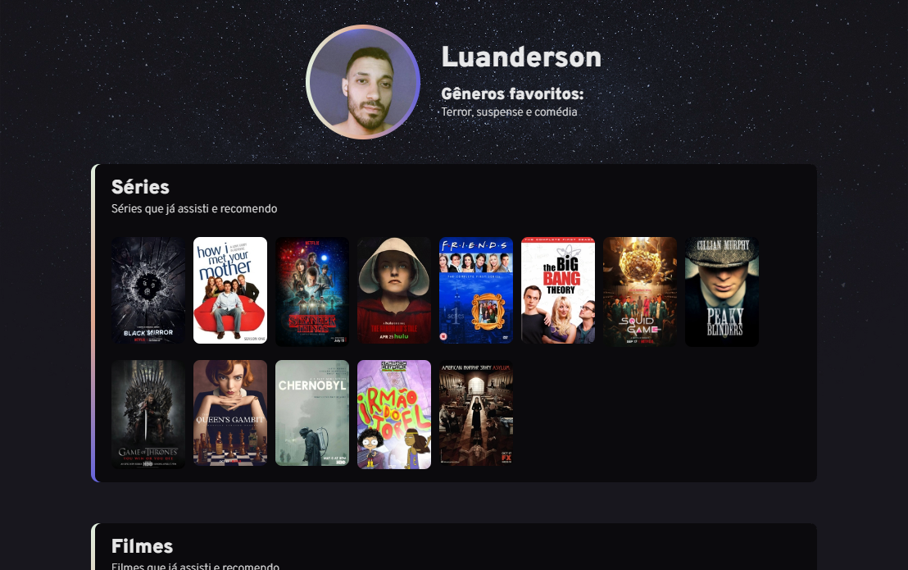

># NLW E-Sports Challanger

> Trilha explorer
## Projeto desafio do evento NLW da Rocketseat
O projeto foi um desafio proposto pela Rocketseat e fiz com varias modificação

🔗 [Acesse clicando aqui!](https://luandersonalvesdev.github.io/nlw-challanger)

## 👨‍💻 APRENDIZADO
- Transições
- Animações
- Gradients images
- Displays

## 🛠️ TECNOLOGIAS USADAS 
- HTML
- CSS
- GIT e Github

## CONTATO

luaoderson@gmail.com